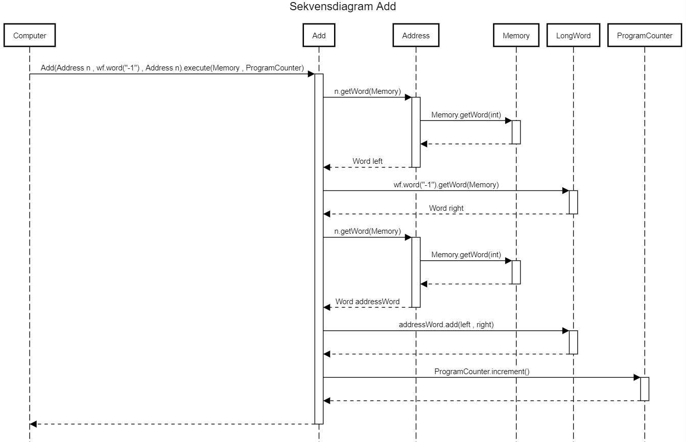

# EDAF60-project1

Inlämningsuppgift 1 i EDAF60

Förberedelseuppgifter: 

1.
Abstrakta klasser:
BinOp
Interface:
Instruction, Word, WordFactory, Operand
Klasser:
Computer, Memory, Copy, Jump, JumpEq, Mul, Add, Print, Halt, ByteWord, LongWord, ByteWordFactory, LongWordFactory, Address, ProgramCounter, Program

2.
Man skulle kunna implementera Javas list-interface för att själv slippa skriva en specifik add-method. Eftersom man ska kunna hoppa till specifika index  hade ArrayList kunnat fungera bra. Dock är List-interfacet väldigt stort, och innefattar mycket funktionalitet som inte hade använts av programmet. Detta hade kunnat påverka effektiviten hos datorn negativt, och dessutom hade det komplicerat utvecklingsprocessen på grund av allt som, trots att det inte behövs, återfinns i interfacet. Ett alternativ till ArrayList är istället att skriva en egen listklass. 

3.
Datorn som modelleras i uppgiften består egentligen enbart av Computer, Memory, Address, Program, Instruction och ProgramCounter. Allt annat utöver dessa beror på vad man vill göra med datorn dvs dess funktionalitet, och är alltså en del av implementationen, inte av själva datorn. 
Paketen kan alltså defineras som Computer.Hardware och Computer.Implementation 

4.
Command pattern innebär att för varje sak vi vill kunna göra har vi en klass som implementerar ett interface med en execute-metod. Detta mönster passar bra ihop med de Instructions som ska utföras. Man kan alltså ge Instruction-interfacet en metod execute(), som sedan implementeras av de instruktioner som ska utföras. 

5.
På flera ställen i projektuppgiften skulle det kunna uppstå duplicerad kod. Ett exempel som tagits upp på föreläsningarna är Add och Mul, där mycket av koden liknar varandra. För att förhålla sig till DRY kan man skapa en abstrakt klass BinOp med de gemensamma delarna från Add och Mul. Detsamma skulle kunna gälla för Word, om man istället för ett interface gjort den till en abstrakt klass, och låtit LongWord och ByteWord ärva från den.

6.
I Strategy delegerar man till andra objekt för att utföra operationer. I detta fall skulle man kunna se interfacet Instruction som en form av Strategy, detta eftersom Instruction har en execute-metod, men har egentligen inget att exekvera, utan låter klasserna som implementerar interfacet definiera vad som händer när en execute körs på en instruktion.

7.
Eftersom Add-klassen definierar hur additionen ska utföras bör additionen även köras där. 

8.
Sekvensdiagram av add. 

9.
Eftersom orden är av olika typ bör man kasta ett typfel. Operationen kan inte utföras på korrekt sätt när man använder olika ord.  

