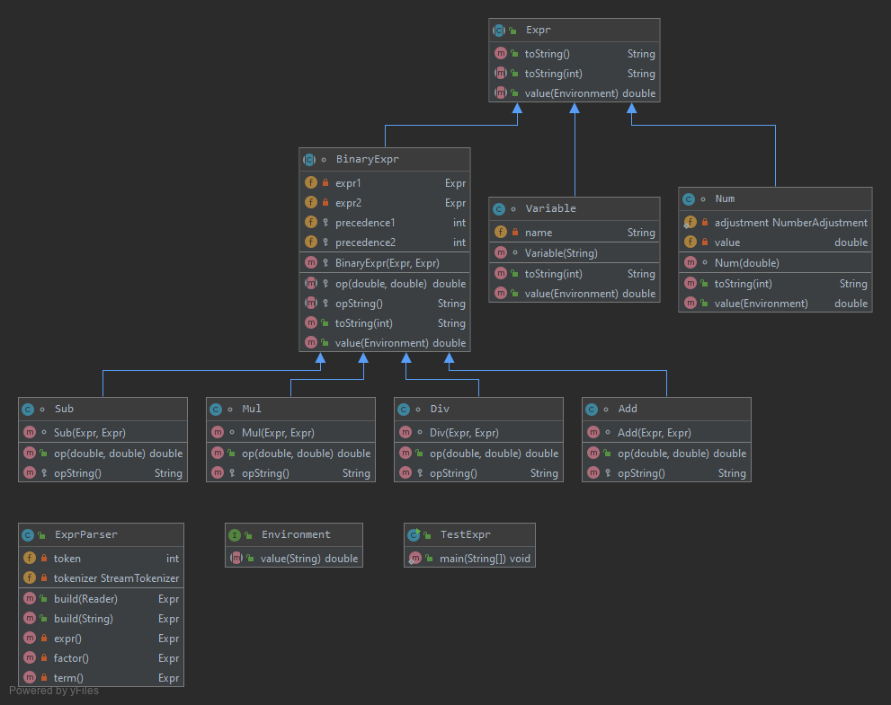
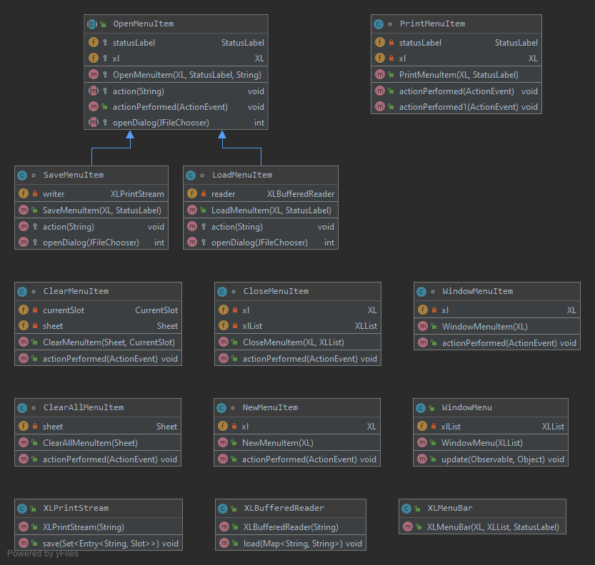
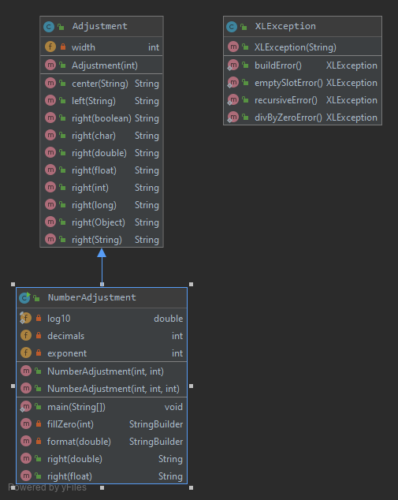
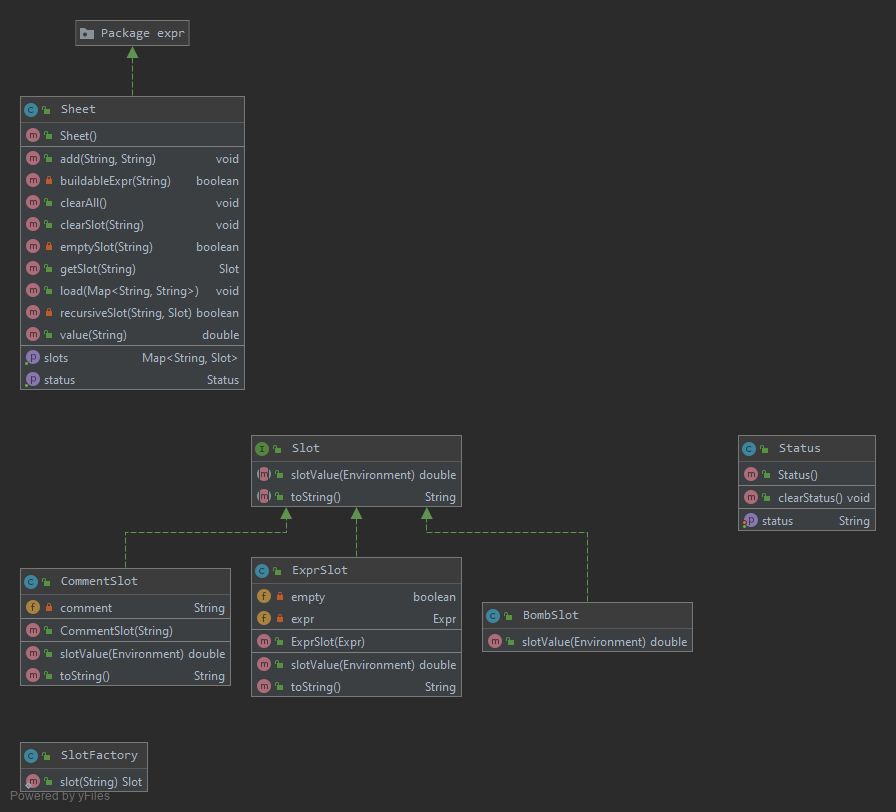

# EDAF60-project2

1. **Fyll i ett uttryck i en ruta**

Användaren väljer en ruta, därefter trycker de på 'editorn' och påbörjar uttrycket och avslutar med ENTER. Uttrycket visas i markerad ruta i 'the storage area'

2. **Fyll i en kommentar i en ruta**

Användaren väljer en ruta, därefter trycker de på 'editorn' och påbörjar kommentaren med en '#' och avslutar med ENTER. Kommentaren visas i markerad ruta i 'the storage area'.

3. **Fyll i ett värde i en ruta**

Användaren väljer en ruta, därefter trycker de på 'editorn' och påbörjar att skriva värdet och avslutar med ENTER. Värdet visas i markerad ruta i 'the storage area'

4. **Print**

Användaren trycker på 'File' som finns på 'Menu bar',och väljer 'Print'  från pull down menu. Ett nytt fönster öppnas, där användaren kan ställa in sin utskriftspreferns.

5. **Save**

Användaren trycker på 'File' som finns på 'Menu bar',och väljer 'Save' från pull down menu. Ett nytt fönster öppnas, där användaren kan välja sparplats.

6. **Open**

Användaren trycker på 'File' som finns på 'Menu bar',och väljer 'Open' från pull down menu. Ett nytt fönster öppnas, där användaren kan välja ett sparat kalkylblad att öppna.

7. **New**

Användaren trycker på 'File' som finns på 'Menu bar',och väljer 'New' från pull down menu. Ett nytt fönster öppnas, med ett tomt kalkylblad.

8. **Close**

Användaren trycker på 'File' som finns på 'Menu bar',och väljer 'Close' från pull down menu. Det aktuella fönstret stängs och innehållet går förlorat.

9. **Clear**

Användaren markerar en ruta och trycker därefter på 'Edit' som finns på 'Menu bar',och väljer 'Clear current slot' från pull down menu. Den markerade rutans innehåll raderas.

10. **Clear all**

Använder trycker på 'Edit' som finns på 'Menu bar' och väljer 'Clear all'. Innehållet i alla rutor på kalkylbladet raderas.

11. **Switch window**

Användaren trycker på 'Window' som finns på 'Menu bar', vilket resulterar i att ett pull down menu visar alla öppna fönster. Användaren kan nu välja från denna lista och de fönster användaren väljer flyttas längst fram.

**Class diagrams**

**Expr package**

**GUI package**

**Menu package**

**Util package**

**Model package**

 
**Spenderad tid** 

David Jungermann : 20 timmar

Clara Mauritzson : 6 timmar

Robin Vinterbladh: 15 timmar

Dalia Abbas: 9 timmar